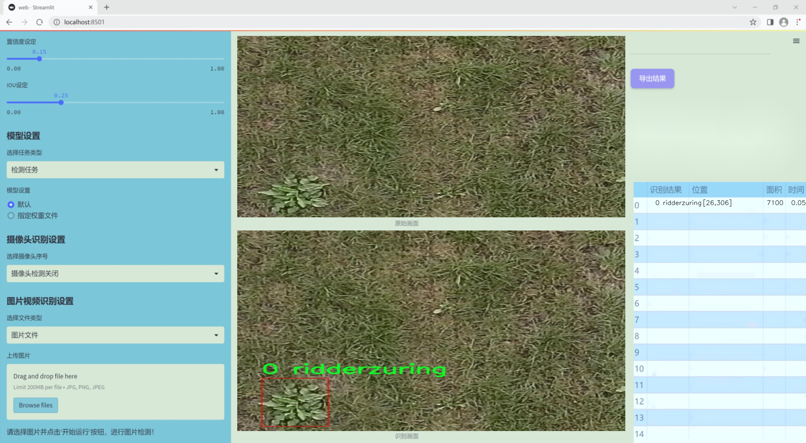
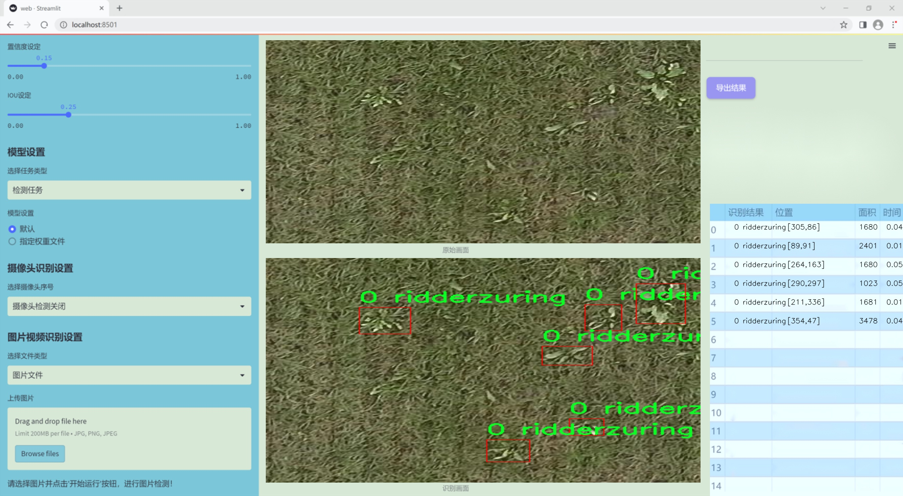
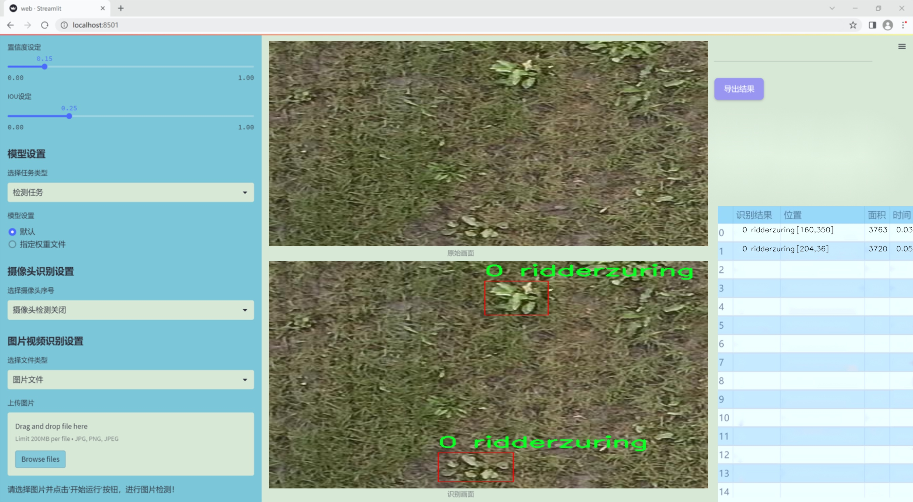
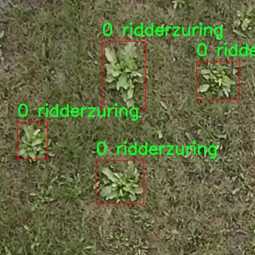
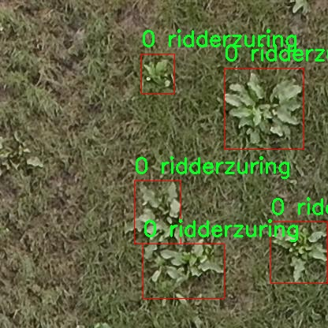
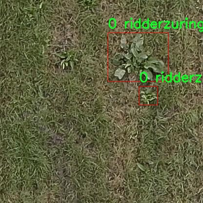
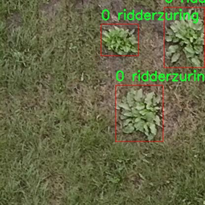
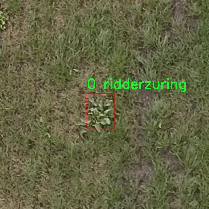

# 改进yolo11-fasternet-bifpn等200+全套创新点大全：航拍图草地杂草检测系统源码＆数据集全套

### 1.图片效果展示







##### 项目来源 **[人工智能促进会 2024.10.30](https://kdocs.cn/l/cszuIiCKVNis)**

注意：由于项目一直在更新迭代，上面“1.图片效果展示”和“2.视频效果展示”展示的系统图片或者视频可能为老版本，新版本在老版本的基础上升级如下：（实际效果以升级的新版本为准）

  （1）适配了YOLOV11的“目标检测”模型和“实例分割”模型，通过加载相应的权重（.pt）文件即可自适应加载模型。

  （2）支持“图片识别”、“视频识别”、“摄像头实时识别”三种识别模式。

  （3）支持“图片识别”、“视频识别”、“摄像头实时识别”三种识别结果保存导出，解决手动导出（容易卡顿出现爆内存）存在的问题，识别完自动保存结果并导出到tempDir中。

  （4）支持Web前端系统中的标题、背景图等自定义修改。

  另外本项目提供训练的数据集和训练教程,暂不提供权重文件（best.pt）,需要您按照教程进行训练后实现图片演示和Web前端界面演示的效果。

### 2.视频效果展示

[2.1 视频效果展示](https://www.bilibili.com/video/BV1dESjYBEri/)

### 3.背景

研究背景与意义

随着农业现代化的不断推进，精准农业的理念逐渐深入人心。在这一背景下，草地杂草的检测与管理成为了提高农作物产量和质量的重要环节。传统的杂草检测方法依赖于人工观察和经验判断，不仅效率低下，而且容易受到主观因素的影响，导致检测结果的不准确。因此，开发一种高效、准确的草地杂草检测系统显得尤为重要。

近年来，深度学习技术的迅猛发展为目标检测领域带来了新的机遇。YOLO（You Only Look Once）系列模型因其实时性和高准确率而受到广泛关注。尤其是YOLOv11的出现，进一步提升了目标检测的性能，成为研究者们关注的焦点。通过对YOLOv11进行改进，可以更好地适应航拍图像中草地杂草的检测需求，从而提高检测的准确性和效率。

本研究将基于改进的YOLOv11模型，构建一个专门针对航拍图草地杂草的检测系统。数据集方面，我们将使用包含2500张图像的“grass weeds”数据集，其中涵盖了特定类别的杂草——ridderzuring。这一数据集的构建为模型的训练和验证提供了坚实的基础，确保了检测系统的实用性和可靠性。

通过本项目的实施，不仅可以为农民提供一种高效的杂草检测工具，帮助他们及时采取措施，减少杂草对农作物的影响，还可以为精准农业的发展提供有力的技术支持。此外，该系统的成功应用将为其他农业领域的智能化管理提供借鉴，推动农业科技的进一步发展。

### 4.数据集信息展示

##### 4.1 本项目数据集详细数据（类别数＆类别名）

nc: 1
names: ['0 ridderzuring']


该项目为【目标检测】数据集，请在【训练教程和Web端加载模型教程（第三步）】这一步的时候按照【目标检测】部分的教程来训练

##### 4.2 本项目数据集信息介绍

本项目数据集信息介绍

本项目所使用的数据集名为“grass weeds”，旨在为改进YOLOv11的航拍图草地杂草检测系统提供高质量的训练数据。该数据集专注于草地中杂草的识别与分类，特别是针对“0 ridderzuring”这一特定杂草种类。数据集的设计考虑到了航拍图像的特性，包含了多种不同环境下的草地图像，以确保模型在多样化场景中的泛化能力。

“grass weeds”数据集包含丰富的图像样本，涵盖了不同光照条件、季节变化及生长状态下的“0 ridderzuring”杂草。这些图像经过精心标注，确保每一张图像中的杂草都能被准确识别。数据集的单一类别设计使得模型能够集中学习该杂草的特征，提升检测的准确性和效率。此外，数据集中的图像分辨率较高，能够提供清晰的细节信息，有助于YOLOv11模型在进行特征提取时获得更为丰富的上下文信息。

在数据集的构建过程中，特别注重样本的多样性与代表性，以模拟实际应用中可能遇到的各种情况。这种多样性不仅提高了模型的鲁棒性，还增强了其在真实环境中应用的潜力。通过对“grass weeds”数据集的深入分析与训练，期望能够显著提升YOLOv11在草地杂草检测任务中的表现，为农业管理与生态监测提供有效的技术支持。总之，本项目的数据集为研究人员和开发者提供了一个理想的平台，以推动草地杂草检测技术的进步与应用。











### 5.全套项目环境部署视频教程（零基础手把手教学）

[5.1 所需软件PyCharm和Anaconda安装教程（第一步）](https://www.bilibili.com/video/BV1BoC1YCEKi/?spm_id_from=333.999.0.0&vd_source=bc9aec86d164b67a7004b996143742dc)


[5.2 安装Python虚拟环境创建和依赖库安装视频教程（第二步）](https://www.bilibili.com/video/BV1ZoC1YCEBw?spm_id_from=333.788.videopod.sections&vd_source=bc9aec86d164b67a7004b996143742dc)

### 6.改进YOLOv11训练教程和Web_UI前端加载模型教程（零基础手把手教学）

[6.1 改进YOLOv11训练教程和Web_UI前端加载模型教程（第三步）](https://www.bilibili.com/video/BV1BoC1YCEhR?spm_id_from=333.788.videopod.sections&vd_source=bc9aec86d164b67a7004b996143742dc)


按照上面的训练视频教程链接加载项目提供的数据集，运行train.py即可开始训练



     Epoch   gpu_mem       box       obj       cls    labels  img_size
     1/200     20.8G   0.01576   0.01955  0.007536        22      1280: 100%|██████████| 849/849 [14:42<00:00,  1.04s/it]
               Class     Images     Labels          P          R     mAP@.5 mAP@.5:.95: 100%|██████████| 213/213 [01:14<00:00,  2.87it/s]
                 all       3395      17314      0.994      0.957      0.0957      0.0843

     Epoch   gpu_mem       box       obj       cls    labels  img_size
     2/200     20.8G   0.01578   0.01923  0.007006        22      1280: 100%|██████████| 849/849 [14:44<00:00,  1.04s/it]
               Class     Images     Labels          P          R     mAP@.5 mAP@.5:.95: 100%|██████████| 213/213 [01:12<00:00,  2.95it/s]
                 all       3395      17314      0.996      0.956      0.0957      0.0845

     Epoch   gpu_mem       box       obj       cls    labels  img_size
     3/200     20.8G   0.01561    0.0191  0.006895        27      1280: 100%|██████████| 849/849 [10:56<00:00,  1.29it/s]
               Class     Images     Labels          P          R     mAP@.5 mAP@.5:.95: 100%|███████   | 187/213 [00:52<00:00,  4.04it/s]
                 all       3395      17314      0.996      0.957      0.0957      0.0845


###### [项目数据集下载链接](https://kdocs.cn/l/cszuIiCKVNis)

### 7.原始YOLOv11算法讲解

YOLOv11是Ultralytics推出的YOLO系列最新版本，专为实现尖端的物体检测而设计。其架构和训练方法上进行了重大改进，使之不仅具备卓越的准确性和处理速度，还在计算效率上实现了一场革命。得益于其改进的主干和颈部架构，YOLOv11在特征提取和处理复杂任务时表现更加出色。在2024年9月27日，Ultralytics通过长达九小时的在线直播发布这一新作，展示了其在计算机视觉领域的革新。

YOLOv11通过精细的架构设计和优化训练流程，在保持高精度的同时，缩减了参数量，与YOLOv8m相比减少了22%的参数，使其在COCO数据集上的平均准确度（mAP）有所提升。这种效率的提高使YOLOv11非常适合部署在各种硬件环境中，包括边缘设备、云计算平台以及支持NVIDIA GPU的系统，确保在灵活性上的优势。

该模型支持广泛的任务，从对象检测、实例分割到图像分类、姿态估计和定向对象检测（OBB），几乎覆盖了计算机视觉的所有主要挑战。其创新的C3k2和C2PSA模块提升了网络深度和注意力机制的应用，提高了特征提取的效率和效果。同时，YOLOv11的改进网络结构也使之在复杂视觉任务上得以从容应对，成为各类计算机视觉任务的多功能选择。这些特性令YOLOv11在实施实时物体检测的各个领域中表现出众。
* * *

2024年9月27日，Ultralytics在线直播长达九小时，为YOLO11召开“发布会”

YOLO11 是 Ultralytics YOLO 系列实时物体检测器的最新版本，它以尖端的准确性、速度和效率重新定义了可能性。在之前 YOLO
版本的显著进步的基础上，YOLO11 在架构和训练方法方面进行了重大改进，使其成为各种计算机视觉任务的多功能选择。


##### YOLO11主要特点：

  * 增强的特征提取：YOLO11 采用了改进的主干和颈部架构，增强了特征提取能力，可实现更精确的对象检测和复杂任务性能。
  * 针对效率和速度进行了优化：YOLO11 引入了完善的架构设计和优化的训练流程，可提供更快的处理速度，并在准确度和性能之间保持最佳平衡。
  * 更少的参数，更高的准确度：借助模型设计的进步，YOLO11m 在 COCO 数据集上实现了更高的平均准确度 (mAP)，同时使用的参数比 YOLOv8m 少 22%，从而提高了计算效率，同时又不影响准确度。
  * 跨环境的适应性：YOLO11 可以无缝部署在各种环境中，包括边缘设备、云平台和支持 NVIDIA GPU 的系统，从而确保最大的灵活性。
  * 支持的任务范围广泛：无论是对象检测、实例分割、图像分类、姿势估计还是定向对象检测 (OBB)，YOLO11 都旨在满足各种计算机视觉挑战。

##### 支持的任务和模式

YOLO11 以 YOLOv8 中引入的多功能模型系列为基础，为各种计算机视觉任务提供增强的支持：

Model| Filenames| Task| Inference| Validation| Training| Export  
---|---|---|---|---|---|---  
YOLO11| yolol11n.pt, yolol11s.pt, yolol11m.pt, yolol11x.pt| Detection| ✅| ✅|
✅| ✅  
YOLO11-seg| yolol11n-seg.pt, yolol11s-seg.pt, yolol11m-seg.pt,
yolol11x-seg.pt| Instance Segmentation| ✅| ✅| ✅| ✅  
YOLO11-pose| yolol11n-pose.pt, yolol11s-pose.pt, yolol11m-pose.pt,
yolol11x-pose.pt| Pose/Keypoints| ✅| ✅| ✅| ✅  
YOLO11-obb| yolol11n-obb.pt, yolol11s-obb.pt, yolol11m-obb.pt,
yolol11x-obb.pt| Oriented Detection| ✅| ✅| ✅| ✅  
YOLO11-cls| yolol11n-cls.pt, yolol11s-cls.pt, yolol11m-cls.pt,
yolol11x-cls.pt| Classification| ✅| ✅| ✅| ✅  
  
##### 简单的 YOLO11 训练和推理示例

以下示例适用于用于对象检测的 YOLO11 Detect 模型。

    
    
    from ultralytics import YOLO
    
    # Load a model
    model = YOLO("yolo11n.pt")
    
    # Train the model
    train_results = model.train(
        data="coco8.yaml",  # path to dataset YAML
        epochs=100,  # number of training epochs
        imgsz=640,  # training image size
        device="cpu",  # device to run on, i.e. device=0 or device=0,1,2,3 or device=cpu
    )
    
    # Evaluate model performance on the validation set
    metrics = model.val()
    
    # Perform object detection on an image
    results = model("path/to/image.jpg")
    results[0].show()
    
    # Export the model to ONNX format
    path = model.export(format="onnx")  # return path to exported model

##### 支持部署于边缘设备

YOLO11 专为适应各种环境而设计，包括边缘设备。其优化的架构和高效的处理能力使其适合部署在边缘设备、云平台和支持 NVIDIA GPU
的系统上。这种灵活性确保 YOLO11 可用于各种应用，从移动设备上的实时检测到云环境中的复杂分割任务。有关部署选项的更多详细信息，请参阅导出文档。

##### YOLOv11 yaml文件

    
    
    # Ultralytics YOLO 🚀, AGPL-3.0 license
    # YOLO11 object detection model with P3-P5 outputs. For Usage examples see https://docs.ultralytics.com/tasks/detect
    
    # Parameters
    nc: 80 # number of classes
    scales: # model compound scaling constants, i.e. 'model=yolo11n.yaml' will call yolo11.yaml with scale 'n'
      # [depth, width, max_channels]
      n: [0.50, 0.25, 1024] # summary: 319 layers, 2624080 parameters, 2624064 gradients, 6.6 GFLOPs
      s: [0.50, 0.50, 1024] # summary: 319 layers, 9458752 parameters, 9458736 gradients, 21.7 GFLOPs
      m: [0.50, 1.00, 512] # summary: 409 layers, 20114688 parameters, 20114672 gradients, 68.5 GFLOPs
      l: [1.00, 1.00, 512] # summary: 631 layers, 25372160 parameters, 25372144 gradients, 87.6 GFLOPs
      x: [1.00, 1.50, 512] # summary: 631 layers, 56966176 parameters, 56966160 gradients, 196.0 GFLOPs
    
    # YOLO11n backbone
    backbone:
      # [from, repeats, module, args]
      - [-1, 1, Conv, [64, 3, 2]] # 0-P1/2
      - [-1, 1, Conv, [128, 3, 2]] # 1-P2/4
      - [-1, 2, C3k2, [256, False, 0.25]]
      - [-1, 1, Conv, [256, 3, 2]] # 3-P3/8
      - [-1, 2, C3k2, [512, False, 0.25]]
      - [-1, 1, Conv, [512, 3, 2]] # 5-P4/16
      - [-1, 2, C3k2, [512, True]]
      - [-1, 1, Conv, [1024, 3, 2]] # 7-P5/32
      - [-1, 2, C3k2, [1024, True]]
      - [-1, 1, SPPF, [1024, 5]] # 9
      - [-1, 2, C2PSA, [1024]] # 10
    
    # YOLO11n head
    head:
      - [-1, 1, nn.Upsample, [None, 2, "nearest"]]
      - [[-1, 6], 1, Concat, [1]] # cat backbone P4
      - [-1, 2, C3k2, [512, False]] # 13
    
      - [-1, 1, nn.Upsample, [None, 2, "nearest"]]
      - [[-1, 4], 1, Concat, [1]] # cat backbone P3
      - [-1, 2, C3k2, [256, False]] # 16 (P3/8-small)
    
      - [-1, 1, Conv, [256, 3, 2]]
      - [[-1, 13], 1, Concat, [1]] # cat head P4
      - [-1, 2, C3k2, [512, False]] # 19 (P4/16-medium)
    
      - [-1, 1, Conv, [512, 3, 2]]
      - [[-1, 10], 1, Concat, [1]] # cat head P5
      - [-1, 2, C3k2, [1024, True]] # 22 (P5/32-large)
    
      - [[16, 19, 22], 1, Detect, [nc]] # Detect(P3, P4, P5)
    

**YOLO11和YOLOv8 yaml文件的区别**


##### 改进模块代码

  * C3k2 

    
    
    class C3k2(C2f):
        """Faster Implementation of CSP Bottleneck with 2 convolutions."""
    
        def __init__(self, c1, c2, n=1, c3k=False, e=0.5, g=1, shortcut=True):
            """Initializes the C3k2 module, a faster CSP Bottleneck with 2 convolutions and optional C3k blocks."""
            super().__init__(c1, c2, n, shortcut, g, e)
            self.m = nn.ModuleList(
                C3k(self.c, self.c, 2, shortcut, g) if c3k else Bottleneck(self.c, self.c, shortcut, g) for _ in range(n)
            )

C3k2，它是具有两个卷积的CSP（Partial Cross Stage）瓶颈架构的更快实现。

**类继承：**

  * `C3k2`继承自类`C2f`。这表明`C2f`很可能实现了经过修改的基本CSP结构，而`C3k2`进一步优化或修改了此结构。

**构造函数（`__init__`）：**

  * `c1`：输入通道。

  * `c2`：输出通道。

  * `n`：瓶颈层数（默认为1）。

  * `c3k`：一个布尔标志，确定是否使用`C3k`块或常规`Bottleneck`块。

  * `e`：扩展比率，控制隐藏层的宽度（默认为0.5）。

  * `g`：分组卷积的组归一化参数或组数（默认值为 1）。

  * `shortcut`：一个布尔值，用于确定是否在网络中包含快捷方式连接（默认值为 `True`）。

**初始化：**

  * `super().__init__(c1, c2, n, short-cut, g, e)` 调用父类 `C2f` 的构造函数，初始化标准 CSP 组件，如通道数、快捷方式、组等。

**模块列表（`self.m`）：**

  * `nn.ModuleList` 存储 `C3k` 或 `Bottleneck` 模块，具体取决于 `c3k` 的值。

  * 如果 `c3k` 为 `True`，它会初始化 `C3k` 模块。`C3k` 模块接收以下参数：

  * `self.c`：通道数（源自 `C2f`）。

  * `2`：这表示在 `C3k` 块内使用了两个卷积层。

  * `shortcut` 和 `g`：从 `C3k2` 构造函数传递。

  * 如果 `c3k` 为 `False`，则初始化标准 `Bottleneck` 模块。

`for _ in range(n)` 表示将创建 `n` 个这样的块。

**总结：**

  * `C3k2` 实现了 CSP 瓶颈架构，可以选择使用自定义 `C3k` 块（具有两个卷积）或标准 `Bottleneck` 块，具体取决于 `c3k` 标志。

  * C2PSA

    
    
    class C2PSA(nn.Module):
        """
        C2PSA module with attention mechanism for enhanced feature extraction and processing.
    
        This module implements a convolutional block with attention mechanisms to enhance feature extraction and processing
        capabilities. It includes a series of PSABlock modules for self-attention and feed-forward operations.
    
        Attributes:
            c (int): Number of hidden channels.
            cv1 (Conv): 1x1 convolution layer to reduce the number of input channels to 2*c.
            cv2 (Conv): 1x1 convolution layer to reduce the number of output channels to c.
            m (nn.Sequential): Sequential container of PSABlock modules for attention and feed-forward operations.
    
        Methods:
            forward: Performs a forward pass through the C2PSA module, applying attention and feed-forward operations.
    
        Notes:
            This module essentially is the same as PSA module, but refactored to allow stacking more PSABlock modules.
    
        Examples:
            >>> c2psa = C2PSA(c1=256, c2=256, n=3, e=0.5)
            >>> input_tensor = torch.randn(1, 256, 64, 64)
            >>> output_tensor = c2psa(input_tensor)
        """
    
        def __init__(self, c1, c2, n=1, e=0.5):
            """Initializes the C2PSA module with specified input/output channels, number of layers, and expansion ratio."""
            super().__init__()
            assert c1 == c2
            self.c = int(c1 * e)
            self.cv1 = Conv(c1, 2 * self.c, 1, 1)
            self.cv2 = Conv(2 * self.c, c1, 1)
    
            self.m = nn.Sequential(*(PSABlock(self.c, attn_ratio=0.5, num_heads=self.c // 64) for _ in range(n)))
    
        def forward(self, x):
            """Processes the input tensor 'x' through a series of PSA blocks and returns the transformed tensor."""
            a, b = self.cv1(x).split((self.c, self.c), dim=1)
            b = self.m(b)
            return self.cv2(torch.cat((a, b), 1))

`C2PSA` 模块是一个自定义神经网络层，带有注意力机制，用于增强特征提取和处理。

**类概述**

  * **目的：**

  * `C2PSA` 模块引入了一个卷积块，利用注意力机制来改进特征提取和处理。

  * 它使用一系列 `PSABlock` 模块，这些模块可能代表某种形式的位置自注意力 (PSA)，并且该架构旨在允许堆叠多个 `PSABlock` 层。

**构造函数（`__init__`）：**

  * **参数：**

  * `c1`：输入通道（必须等于 `c2`）。

  * `c2`：输出通道（必须等于 `c1`）。

  * `n`：要堆叠的 `PSABlock` 模块数量（默认值为 1）。

  * `e`：扩展比率，用于计算隐藏通道的数量（默认值为 0.5）。

  * **属性：**

  * `self.c`：隐藏通道数，计算为 `int(c1 * e)`。

  * `self.cv1`：一个 `1x1` 卷积，将输入通道数从 `c1` 减少到 `2 * self.c`。这为将输入分成两部分做好准备。

  * `self.cv2`：另一个 `1x1` 卷积，处理后将通道维度恢复回 `c1`。

  * `self.m`：一系列 `PSABlock` 模块。每个 `PSABlock` 接收 `self.c` 通道，注意头的数量为 `self.c // 64`。每个块应用注意和前馈操作。

**前向方法：**

  * **输入：**

  * `x`，输入张量。

  * **操作：**

  1. `self.cv1(x)` 应用 `1x1` 卷积，将输入通道大小从 `c1` 减小到 `2 * self.c`。

  2. 生成的张量沿通道维度分为两部分，`a` 和 `b`。

  * `a`：第一个 `self.c` 通道。

  * `b`：剩余的 `self.c` 通道。

  1. `b` 通过顺序容器 `self.m`，它是 `PSABlock` 模块的堆栈。这部分经过基于注意的处理。

  2. 处理后的张量 `b` 与 `a` 连接。

  3. `self.cv2` 应用 `1x1` 卷积，将通道大小恢复为 `c1`。

  * **输出：**

  * 应用注意和卷积操作后的变换后的张量。

**总结：**

  * **C2PSA** 是一个增强型卷积模块，它通过堆叠的 `PSABlock` 模块应用位置自注意力。它拆分输入张量，将注意力应用于其中一部分，然后重新组合并通过最终卷积对其进行处理。此结构有助于从输入数据中提取复杂特征。

##### 网络结构


### 8.200+种全套改进YOLOV11创新点原理讲解

#### 8.1 200+种全套改进YOLOV11创新点原理讲解大全

由于篇幅限制，每个创新点的具体原理讲解就不全部展开，具体见下列网址中的改进模块对应项目的技术原理博客网址【Blog】（创新点均为模块化搭建，原理适配YOLOv5~YOLOv11等各种版本）

[改进模块技术原理博客【Blog】网址链接](https://gitee.com/qunmasj/good)


#### 8.2 精选部分改进YOLOV11创新点原理讲解

###### 这里节选部分改进创新点展开原理讲解(完整的改进原理见上图和[改进模块技术原理博客链接](https://gitee.com/qunmasj/good)【如果此小节的图加载失败可以通过CSDN或者Github搜索该博客的标题访问原始博客，原始博客图片显示正常】

### Gold-YOLO


#### Preliminaries
YOLO系列的中间层结构采用了传统的FPN结构，其中包含多个分支用于多尺度特征融合。然而，它只充分融合来自相邻级别的特征，对于其他层次的信息只能间接地进行“递归”获取。

传统的FPN结构在信息传输过程中存在丢失大量信息的问题。这是因为层之间的信息交互仅限于中间层选择的信息，未被选择的信息在传输过程中被丢弃。这种情况导致某个Level的信息只能充分辅助相邻层，而对其他全局层的帮助较弱。因此，整体上信息融合的有效性可能受到限制。
为了避免在传输过程中丢失信息，本文采用了一种新颖的“聚集和分发”机制（GD），放弃了原始的递归方法。该机制使用一个统一的模块来收集和融合所有Level的信息，并将其分发到不同的Level。通过这种方式，作者不仅避免了传统FPN结构固有的信息丢失问题，还增强了中间层的部分信息融合能力，而且并没有显著增加延迟。


#### 低阶聚合和分发分支 Low-stage gather-and-distribute branch
从主干网络中选择输出的B2、B3、B4、B5特征进行融合，以获取保留小目标信息的高分辨率特征。


#### 高阶聚合和分发分支 High-stage gather-and-distribute branch
高级全局特征对齐模块（High-GD）将由低级全局特征对齐模块（Low-GD）生成的特征{P3, P4, P5}进行融合。


Transformer融合模块由多个堆叠的transformer组成，transformer块的数量为L。每个transformer块包括一个多头注意力块、一个前馈网络（FFN）和残差连接。采用与LeViT相同的设置来配置多头注意力块，使用16个通道作为键K和查询Q的头维度，32个通道作为值V的头维度。为了加速推理过程，将层归一化操作替换为批归一化，并将所有的GELU激活函数替换为ReLU。为了增强变换器块的局部连接，在两个1x1卷积层之间添加了一个深度卷积层。同时，将FFN的扩展因子设置为2，以在速度和计算成本之间取得平衡。


信息注入模块(Information injection module)： 高级全局特征对齐模块（High-GD）中的信息注入模块与低级全局特征对齐模块（Low-GD）中的相同。在高级阶段，局部特征（Flocal）等于Pi，因此公式如下所示：


#### 增强的跨层信息流动 Enhanced cross-layer information flow
为了进一步提升性能，从YOLOv6 中的PAFPN模块中得到启发，引入了Inject-LAF模块。该模块是注入模块的增强版，包括了一个轻量级相邻层融合（LAF）模块，该模块被添加到注入模块的输入位置。为了在速度和准确性之间取得平衡，设计了两个LAF模型：LAF低级模型和LAF高级模型，分别用于低级注入（合并相邻两层的特征）和高级注入（合并相邻一层的特征）。它们的结构如图5(b)所示。为了确保来自不同层级的特征图与目标大小对齐，在实现中的两个LAF模型仅使用了三个操作符：双线性插值（上采样过小的特征）、平均池化（下采样过大的特征）和1x1卷积（调整与目标通道不同的特征）。模型中的LAF模块与信息注入模块的结合有效地平衡了准确性和速度之间的关系。通过使用简化的操作，能够增加不同层级之间的信息流路径数量，从而提高性能而不显著增加延迟。


### 9.系统功能展示

图9.1.系统支持检测结果表格显示

  图9.2.系统支持置信度和IOU阈值手动调节

  图9.3.系统支持自定义加载权重文件best.pt(需要你通过步骤5中训练获得)

  图9.4.系统支持摄像头实时识别

  图9.5.系统支持图片识别

  图9.6.系统支持视频识别

  图9.7.系统支持识别结果文件自动保存

  图9.8.系统支持Excel导出检测结果数据


### 10. YOLOv11核心改进源码讲解

#### 10.1 activation.py

以下是对代码的逐文件分析，保留了最核心的部分，并进行了详细的中文注释：

```python
# Ultralytics YOLO 🚀, AGPL-3.0 license
"""激活模块。"""

import torch
import torch.nn as nn

class AGLU(nn.Module):
    """统一激活函数模块，来源于 https://github.com/kostas1515/AGLU。"""

    def __init__(self, device=None, dtype=None) -> None:
        """初始化统一激活函数模块。"""
        super().__init__()
        # 使用Softplus作为激活函数的一部分，beta设置为-1.0
        self.act = nn.Softplus(beta=-1.0)
        # 初始化lambda参数，并将其设为可学习的参数
        self.lambd = nn.Parameter(nn.init.uniform_(torch.empty(1, device=device, dtype=dtype)))  # lambda参数
        # 初始化kappa参数，并将其设为可学习的参数
        self.kappa = nn.Parameter(nn.init.uniform_(torch.empty(1, device=device, dtype=dtype)))  # kappa参数

    def forward(self, x: torch.Tensor) -> torch.Tensor:
        """计算统一激活函数的前向传播。"""
        # 将lambda参数限制在最小值为0.0001，避免出现负值或零
        lam = torch.clamp(self.lambd, min=0.0001)
        # 计算激活函数的输出
        return torch.exp((1 / lam) * self.act((self.kappa * x) - torch.log(lam)))
```

### 代码核心部分分析：

1. **AGLU类**：这是一个自定义的激活函数模块，继承自`nn.Module`，用于实现AGLU（Adaptive Gated Linear Unit）激活函数。

2. **初始化方法`__init__`**：
   - 使用`nn.Softplus`作为激活函数的一部分，`beta`参数设置为-1.0。
   - `lambd`和`kappa`是两个可学习的参数，分别用于控制激活函数的行为。它们通过均匀分布初始化，并且被定义为`nn.Parameter`，使得它们在训练过程中可以被优化。

3. **前向传播方法`forward`**：
   - 输入`x`是一个张量，表示传入激活函数的数据。
   - 使用`torch.clamp`将`lambd`限制在0.0001以上，以避免计算中的数值不稳定性。
   - 计算并返回激活函数的输出，使用了指数函数和Softplus函数的组合。

### 总结：
这个模块实现了一个自适应的激活函数，适用于深度学习模型中，可以根据输入动态调整激活值。通过学习`lambd`和`kappa`参数，模型能够更好地适应不同的数据分布。

这个文件名为 `activation.py`，主要定义了一个名为 `AGLU` 的激活函数模块。该模块是基于 PyTorch 深度学习框架构建的，使用了 AGPL-3.0 许可证。

在文件的开头，首先导入了 PyTorch 及其神经网络模块 `torch.nn`。接着定义了 `AGLU` 类，该类继承自 `nn.Module`，这是 PyTorch 中所有神经网络模块的基类。

在 `AGLU` 类的构造函数 `__init__` 中，初始化了两个参数 `lambd` 和 `kappa`，这两个参数都是通过均匀分布初始化的可学习参数。`lambd` 是一个与激活函数相关的参数，`kappa` 则用于调整输入张量 `x` 的值。此外，构造函数中还定义了一个激活函数 `self.act`，使用了 `nn.Softplus`，其参数 `beta` 被设置为 -1.0。

`forward` 方法是该模块的前向传播函数，它接收一个张量 `x` 作为输入。在这个方法中，首先对 `lambd` 参数进行限制，确保其最小值为 0.0001，以避免在后续计算中出现除以零的情况。然后，计算并返回激活函数的输出。具体来说，输出是通过将输入 `x` 乘以 `kappa`，减去 `lambd` 的对数，再经过 `self.act` 激活函数处理后，最后通过指数函数进行变换。

总体而言，这个模块实现了一种统一的激活函数，结合了可学习的参数，能够在深度学习模型中灵活应用。

#### 10.2 EfficientFormerV2.py

以下是经过简化并注释的核心代码部分，主要包括模型的定义和一些关键组件的实现。

```python
import torch
import torch.nn as nn
import math
import itertools

class Attention4D(nn.Module):
    """4D注意力机制模块"""
    def __init__(self, dim=384, key_dim=32, num_heads=8, attn_ratio=4, resolution=7, act_layer=nn.ReLU, stride=None):
        super().__init__()
        self.num_heads = num_heads  # 注意力头的数量
        self.scale = key_dim ** -0.5  # 缩放因子
        self.key_dim = key_dim  # 键的维度
        self.d = int(attn_ratio * key_dim)  # 注意力输出的维度
        self.dh = self.d * num_heads  # 总的注意力输出维度

        # 处理输入分辨率和步幅
        if stride is not None:
            self.resolution = math.ceil(resolution / stride)
            self.stride_conv = nn.Sequential(
                nn.Conv2d(dim, dim, kernel_size=3, stride=stride, padding=1, groups=dim),
                nn.BatchNorm2d(dim)
            )
            self.upsample = nn.Upsample(scale_factor=stride, mode='bilinear')
        else:
            self.resolution = resolution
            self.stride_conv = None
            self.upsample = None

        # 定义查询、键、值的卷积层
        self.q = nn.Conv2d(dim, num_heads * key_dim, kernel_size=1)
        self.k = nn.Conv2d(dim, num_heads * key_dim, kernel_size=1)
        self.v = nn.Conv2d(dim, num_heads * self.d, kernel_size=1)

        # 注意力偏置
        points = list(itertools.product(range(self.resolution), range(self.resolution)))
        N = len(points)
        attention_offsets = {}
        idxs = []
        for p1 in points:
            for p2 in points:
                offset = (abs(p1[0] - p2[0]), abs(p1[1] - p2[1]))
                if offset not in attention_offsets:
                    attention_offsets[offset] = len(attention_offsets)
                idxs.append(attention_offsets[offset])
        self.attention_biases = nn.Parameter(torch.zeros(num_heads, len(attention_offsets)))
        self.register_buffer('attention_bias_idxs', torch.LongTensor(idxs).view(N, N))

    def forward(self, x):
        """前向传播"""
        B, C, H, W = x.shape
        if self.stride_conv is not None:
            x = self.stride_conv(x)  # 进行步幅卷积

        # 计算查询、键、值
        q = self.q(x).flatten(2).reshape(B, self.num_heads, -1, self.resolution).permute(0, 1, 3, 2)
        k = self.k(x).flatten(2).reshape(B, self.num_heads, -1, self.resolution).permute(0, 1, 2, 3)
        v = self.v(x).flatten(2).reshape(B, self.num_heads, -1, self.resolution).permute(0, 1, 3, 2)

        # 计算注意力权重
        attn = (q @ k) * self.scale + self.attention_biases[:, self.attention_bias_idxs]
        attn = attn.softmax(dim=-1)  # 归一化为概率分布

        # 计算输出
        x = (attn @ v).transpose(2, 3).reshape(B, self.dh, self.resolution, self.resolution)
        if self.upsample is not None:
            x = self.upsample(x)  # 上采样
        return x

class EfficientFormerV2(nn.Module):
    """EfficientFormerV2模型"""
    def __init__(self, layers, embed_dims, num_classes=1000):
        super().__init__()
        self.patch_embed = nn.Conv2d(3, embed_dims[0], kernel_size=3, stride=2, padding=1)  # 初始卷积层
        self.network = nn.ModuleList()  # 存储网络的各个层

        # 构建网络的各个阶段
        for i in range(len(layers)):
            stage = self._make_layer(embed_dims[i], layers[i])  # 创建每一层
            self.network.append(stage)

    def _make_layer(self, dim, layers):
        """创建一层"""
        blocks = []
        for _ in range(layers):
            blocks.append(Attention4D(dim))  # 添加注意力模块
        return nn.Sequential(*blocks)

    def forward(self, x):
        """前向传播"""
        x = self.patch_embed(x)  # 通过初始卷积层
        for block in self.network:
            x = block(x)  # 通过网络的每一层
        return x

# 示例用法
if __name__ == '__main__':
    inputs = torch.randn((1, 3, 640, 640))  # 输入数据
    model = EfficientFormerV2(layers=[2, 2, 2], embed_dims=[32, 64, 128])  # 创建模型
    res = model(inputs)  # 前向传播
    print(res.shape)  # 输出结果的形状
```

### 代码说明：
1. **Attention4D**: 这是一个实现4D注意力机制的模块。它包含了查询、键、值的计算，并通过注意力权重来生成输出。
2. **EfficientFormerV2**: 这是整个模型的定义，包含了初始的卷积层和多个注意力模块的堆叠。
3. **前向传播**: 在`forward`方法中，输入数据首先通过初始卷积层，然后依次通过每个注意力模块，最终输出结果。

该代码是EfficientFormerV2模型的核心部分，主要关注注意力机制和模型的结构设计。

这个程序文件实现了一个名为EfficientFormerV2的深度学习模型，主要用于图像处理任务。该模型的设计灵感来源于高效的视觉变换器（Vision Transformer）架构，旨在提高计算效率和模型性能。

首先，文件中定义了一些模型的超参数，包括不同规模（S0, S1, S2, L）的网络宽度和深度。这些参数通过字典的形式存储，方便后续调用。每种规模的网络在参数数量和性能上都有所不同，适应不同的应用场景。

接下来，文件中定义了多个类，主要包括Attention4D、LGQuery、Attention4DDownsample、Embedding、Mlp、AttnFFN、FFN等。这些类构成了模型的基础组件。Attention4D类实现了一个四维注意力机制，能够处理输入的图像特征并进行自适应的加权。LGQuery类用于生成局部查询特征，Attention4DDownsample类则结合了注意力机制和下采样操作，适用于特征图的降维。

Embedding类负责将输入图像转换为嵌入特征，支持不同的处理方式，如轻量级处理和自适应下采样。Mlp类实现了多层感知机结构，主要用于特征的非线性变换。AttnFFN和FFN类则结合了注意力机制和前馈网络，形成了模型的核心结构。

在EfficientFormerV2类中，模型的整体架构被构建。该类接收多个参数，包括层数、嵌入维度、下采样策略等，并根据这些参数构建网络的各个阶段。模型的前向传播方法定义了如何通过各个模块处理输入数据，并在特定层输出特征。

此外，文件中还定义了一些辅助函数，如update_weight用于更新模型权重，efficientformerv2_s0、efficientformerv2_s1、efficientformerv2_s2和efficientformerv2_l等函数用于创建不同规模的EfficientFormerV2模型，并可加载预训练权重。

最后，在文件的主程序部分，定义了一些测试代码，创建了不同规模的模型实例，并对随机生成的输入数据进行前向传播，输出各层的特征图尺寸。这部分代码用于验证模型的正确性和性能。

总体而言，该文件实现了一个高效的视觉变换器模型，结合了多种深度学习技术，适用于图像分类、目标检测等任务。

#### 10.3 transformer.py

以下是代码中最核心的部分，并附上详细的中文注释：

```python
import torch
import torch.nn as nn
from functools import partial

# 定义线性归一化和RepBN的组合
ln = nn.LayerNorm
linearnorm = partial(LinearNorm, norm1=ln, norm2=RepBN, step=60000)

class TransformerEncoderLayer_RepBN(nn.Module):
    def __init__(self, c1, cm=2048, num_heads=8, dropout=0, act=..., normalize_before=False):
        """
        初始化Transformer编码器层，使用RepBN进行归一化。
        
        参数:
        c1: 输入特征的通道数
        cm: 中间特征的通道数
        num_heads: 注意力头的数量
        dropout: dropout比率
        act: 激活函数
        normalize_before: 是否在注意力计算之前进行归一化
        """
        super().__init__()
        self.norm1 = linearnorm(c1)  # 第一层归一化
        self.norm2 = linearnorm(c1)  # 第二层归一化

class AIFI_RepBN(TransformerEncoderLayer_RepBN):
    """定义AIFI变换器层。"""

    def __init__(self, c1, cm=2048, num_heads=8, dropout=0, act=nn.GELU(), normalize_before=False):
        """初始化AIFI实例，指定参数。"""
        super().__init__(c1, cm, num_heads, dropout, act, normalize_before)

    def forward(self, x):
        """AIFI变换器层的前向传播。"""
        c, h, w = x.shape[1:]  # 获取输入的通道数、高度和宽度
        pos_embed = self.build_2d_sincos_position_embedding(w, h, c)  # 构建2D位置嵌入
        # 将输入张量从形状[B, C, H, W]展平为[B, HxW, C]
        x = super().forward(x.flatten(2).permute(0, 2, 1), pos=pos_embed.to(device=x.device, dtype=x.dtype))
        # 将输出张量恢复为形状[B, C, H, W]
        return x.permute(0, 2, 1).view([-1, c, h, w]).contiguous()

    @staticmethod
    def build_2d_sincos_position_embedding(w, h, embed_dim=256, temperature=10000.0):
        """构建2D正弦-余弦位置嵌入。"""
        assert embed_dim % 4 == 0, "嵌入维度必须是4的倍数，以便进行2D正弦-余弦位置嵌入"
        grid_w = torch.arange(w, dtype=torch.float32)  # 水平方向的网格
        grid_h = torch.arange(h, dtype=torch.float32)  # 垂直方向的网格
        grid_w, grid_h = torch.meshgrid(grid_w, grid_h, indexing="ij")  # 创建网格
        pos_dim = embed_dim // 4  # 计算位置嵌入的维度
        omega = torch.arange(pos_dim, dtype=torch.float32) / pos_dim  # 计算频率
        omega = 1.0 / (temperature**omega)  # 温度缩放

        # 计算正弦和余弦的位置嵌入
        out_w = grid_w.flatten()[..., None] @ omega[None]
        out_h = grid_h.flatten()[..., None] @ omega[None]

        # 返回组合的正弦和余弦位置嵌入
        return torch.cat([torch.sin(out_w), torch.cos(out_w), torch.sin(out_h), torch.cos(out_h)], 1)[None]
```

### 代码核心部分说明：
1. **TransformerEncoderLayer_RepBN**：这是一个变换器编码器层的基础类，使用了RepBN（重参数化批归一化）和标准的层归一化。它定义了两个归一化层`norm1`和`norm2`。

2. **AIFI_RepBN**：这是一个继承自`TransformerEncoderLayer_RepBN`的类，定义了AIFI变换器层。它实现了前向传播方法，并构建了2D正弦-余弦位置嵌入。

3. **build_2d_sincos_position_embedding**：这是一个静态方法，用于生成2D位置嵌入，确保嵌入维度是4的倍数，并通过正弦和余弦函数生成位置编码。

这个程序文件定义了一个基于Transformer架构的编码器层，特别是实现了带有重参数化批归一化（RepBN）的AIFI（Attention with Improved Feature Interaction）层。文件中首先导入了必要的PyTorch库和模块，包括神经网络（nn）和功能性操作（F），以及一些自定义的模块。

在文件中，首先定义了一个名为`linearnorm`的部分函数，它结合了层归一化（LayerNorm）和重参数化批归一化（RepBN），并设置了一个步长参数。接着，定义了一个名为`TransformerEncoderLayer_RepBN`的类，该类继承自`TransformerEncoderLayer`。在其构造函数中，调用了父类的构造函数，并初始化了两个归一化层，分别为`norm1`和`norm2`，这两个层使用了之前定义的`linearnorm`。

接下来，定义了`AIFI_RepBN`类，它继承自`TransformerEncoderLayer_RepBN`，并实现了AIFI Transformer层的具体功能。在其构造函数中，调用了父类的构造函数，并可以接受多个参数，如输入通道数、隐藏层大小、头数、丢弃率、激活函数等。

在`AIFI_RepBN`类中，重写了`forward`方法，该方法实现了前向传播的过程。首先，获取输入张量的形状信息（通道数、高度和宽度），然后构建二维正弦余弦位置嵌入。接着，将输入张量从形状[B, C, H, W]展平为[B, HxW, C]，并调用父类的`forward`方法进行处理，最后将输出张量的形状转换回原来的格式。

此外，`AIFI_RepBN`类中还定义了一个静态方法`build_2d_sincos_position_embedding`，用于构建二维正弦余弦位置嵌入。该方法接受宽度、高度、嵌入维度和温度参数，确保嵌入维度能够被4整除。通过生成网格坐标并计算正弦和余弦值，最终返回一个包含位置嵌入的张量。

总体而言，这个文件实现了一个增强的Transformer编码器层，结合了位置嵌入和重参数化批归一化的技术，旨在提高模型的性能和表达能力。

#### 10.4 attention.py

以下是经过简化和注释的核心代码部分，主要保留了 `EMA`, `SimAM`, `SpatialGroupEnhance`, `TopkRouting`, `KVGather`, `QKVLinear`, `BiLevelRoutingAttention` 等类的实现，并对每个类的功能进行了详细的中文注释。

```python
import torch
from torch import nn
import torch.nn.functional as F

class EMA(nn.Module):
    """ 
    指数移动平均 (Exponential Moving Average) 模块 
    用于计算输入特征的加权平均值，增强特征表示能力。
    """
    def __init__(self, channels, factor=8):
        super(EMA, self).__init__()
        self.groups = factor  # 将通道分成多个组
        assert channels // self.groups > 0  # 确保每组有通道
        self.softmax = nn.Softmax(-1)  # 用于计算权重
        self.agp = nn.AdaptiveAvgPool2d((1, 1))  # 自适应平均池化
        self.pool_h = nn.AdaptiveAvgPool2d((None, 1))  # 对高度进行池化
        self.pool_w = nn.AdaptiveAvgPool2d((1, None))  # 对宽度进行池化
        self.gn = nn.GroupNorm(channels // self.groups, channels // self.groups)  # 组归一化
        self.conv1x1 = nn.Conv2d(channels // self.groups, channels // self.groups, kernel_size=1)  # 1x1卷积
        self.conv3x3 = nn.Conv2d(channels // self.groups, channels // self.groups, kernel_size=3, padding=1)  # 3x3卷积

    def forward(self, x):
        b, c, h, w = x.size()  # 获取输入的批量大小、通道数、高度和宽度
        group_x = x.reshape(b * self.groups, -1, h, w)  # 将输入重塑为多个组
        x_h = self.pool_h(group_x)  # 对每组进行高度池化
        x_w = self.pool_w(group_x).permute(0, 1, 3, 2)  # 对每组进行宽度池化并转置
        hw = self.conv1x1(torch.cat([x_h, x_w], dim=2))  # 连接并通过1x1卷积
        x_h, x_w = torch.split(hw, [h, w], dim=2)  # 分割回高度和宽度
        x1 = self.gn(group_x * x_h.sigmoid() * x_w.permute(0, 1, 3, 2).sigmoid())  # 计算加权特征
        x2 = self.conv3x3(group_x)  # 通过3x3卷积计算特征
        weights = (self.softmax(self.agp(x1).reshape(b * self.groups, -1, 1).permute(0, 2, 1)) + 
                   self.softmax(self.agp(x2).reshape(b * self.groups, -1, 1).permute(0, 2, 1))).reshape(b * self.groups, 1, h, w)  # 计算权重
        return (group_x * weights.sigmoid()).reshape(b, c, h, w)  # 返回加权后的特征

class SimAM(nn.Module):
    """ 
    SimAM (Simple Attention Module) 
    用于增强特征的表示能力，基于输入特征的均值进行自适应加权。
    """
    def __init__(self, e_lambda=1e-4):
        super(SimAM, self).__init__()
        self.activaton = nn.Sigmoid()  # 激活函数
        self.e_lambda = e_lambda  # 正则化参数

    def forward(self, x):
        b, c, h, w = x.size()  # 获取输入的批量大小、通道数、高度和宽度
        n = w * h - 1  # 计算总的像素数
        x_minus_mu_square = (x - x.mean(dim=[2, 3], keepdim=True)).pow(2)  # 计算每个像素与均值的平方差
        y = x_minus_mu_square / (4 * (x_minus_mu_square.sum(dim=[2, 3], keepdim=True) / n + self.e_lambda)) + 0.5  # 计算自适应权重
        return x * self.activaton(y)  # 返回加权后的特征

class SpatialGroupEnhance(nn.Module):
    """ 
    空间组增强模块 
    通过自适应加权增强特征表示。
    """
    def __init__(self, groups=8):
        super().__init__()
        self.groups = groups  # 组数
        self.avg_pool = nn.AdaptiveAvgPool2d(1)  # 自适应平均池化
        self.weight = nn.Parameter(torch.zeros(1, groups, 1, 1))  # 权重参数
        self.bias = nn.Parameter(torch.zeros(1, groups, 1, 1))  # 偏置参数
        self.sig = nn.Sigmoid()  # 激活函数
        self.init_weights()  # 初始化权重

    def init_weights(self):
        for m in self.modules():
            if isinstance(m, nn.Conv2d):
                nn.init.kaiming_normal_(m.weight, mode='fan_out')  # Kaiming初始化
                if m.bias is not None:
                    nn.init.constant_(m.bias, 0)  # 偏置初始化为0

    def forward(self, x):
        b, c, h, w = x.shape  # 获取输入的批量大小、通道数、高度和宽度
        x = x.view(b * self.groups, -1, h, w)  # 重塑输入
        xn = x * self.avg_pool(x)  # 计算加权特征
        xn = xn.sum(dim=1, keepdim=True)  # 对组进行求和
        t = xn.view(b * self.groups, -1)  # 重塑
        t = t - t.mean(dim=1, keepdim=True)  # 减去均值
        std = t.std(dim=1, keepdim=True) + 1e-5  # 计算标准差
        t = t / std  # 归一化
        t = t.view(b, self.groups, h, w)  # 重塑
        t = t * self.weight + self.bias  # 加权
        x = x * self.sig(t)  # 返回加权后的特征
        return x.view(b, c, h, w)  # 恢复原始形状

class TopkRouting(nn.Module):
    """ 
    可微分的 Top-k 路由模块 
    用于选择特征中的 Top-k 重要部分。
    """
    def __init__(self, qk_dim, topk=4):
        super().__init__()
        self.topk = topk  # Top-k 参数
        self.qk_dim = qk_dim  # 查询和键的维度
        self.scale = qk_dim ** -0.5  # 缩放因子
        self.routing_act = nn.Softmax(dim=-1)  # Softmax激活

    def forward(self, query: Tensor, key: Tensor) -> Tuple[Tensor]:
        """
        Args:
            query, key: (n, p^2, c) tensor
        Return:
            r_weight, topk_index: (n, p^2, topk) tensor
        """
        query_hat, key_hat = query, key  # 直接使用查询和键
        attn_logit = (query_hat * self.scale) @ key_hat.transpose(-2, -1)  # 计算注意力得分
        topk_attn_logit, topk_index = torch.topk(attn_logit, k=self.topk, dim=-1)  # 选择Top-k
        r_weight = self.routing_act(topk_attn_logit)  # 计算路由权重
        return r_weight, topk_index  # 返回权重和索引

class KVGather(nn.Module):
    """ 
    K-V 收集模块 
    用于根据路由索引收集键值对。
    """
    def __init__(self, mul_weight='none'):
        super().__init__()
        assert mul_weight in ['none', 'soft', 'hard']  # 检查加权方式
        self.mul_weight = mul_weight  # 存储加权方式

    def forward(self, r_idx: Tensor, r_weight: Tensor, kv: Tensor):
        """
        r_idx: (n, p^2, topk) tensor
        r_weight: (n, p^2, topk) tensor
        kv: (n, p^2, w^2, c_kq+c_v)

        Return:
            (n, p^2, topk, w^2, c_kq+c_v) tensor
        """
        n, p2, w2, c_kv = kv.size()  # 获取kv的尺寸
        topk = r_idx.size(-1)  # 获取Top-k数量
        topk_kv = torch.gather(kv.view(n, 1, p2, w2, c_kv).expand(-1, p2, -1, -1, -1),  # 收集键值对
                                dim=2,
                                index=r_idx.view(n, p2, topk, 1, 1).expand(-1, -1, -1, w2, c_kv))  # 根据索引收集
        if self.mul_weight == 'soft':
            topk_kv = r_weight.view(n, p2, topk, 1, 1) * topk_kv  # 软加权
        return topk_kv  # 返回收集的键值对

class QKVLinear(nn.Module):
    """ 
    QKV 线性映射模块 
    用于将输入特征映射到查询、键和值的空间。
    """
    def __init__(self, dim, qk_dim, bias=True):
        super().__init__()
        self.qkv = nn.Linear(dim, qk_dim + qk_dim + dim, bias=bias)  # 线性映射

    def forward(self, x):
        q, kv = self.qkv(x).split([self.qk_dim, self.qk_dim + x.size(1)], dim=-1)  # 分割为查询和键值
        return q, kv  # 返回查询和键值

class BiLevelRoutingAttention(nn.Module):
    """ 
    双层路由注意力模块 
    结合了局部和全局注意力机制。
    """
    def __init__(self, dim, num_heads=8, n_win=7, qk_dim=None):
        super().__init__()
        self.dim = dim  # 输入特征维度
        self.n_win = n_win  # 窗口数量
        self.num_heads = num_heads  # 注意力头数量
        self.qk_dim = qk_dim or dim  # 查询和键的维度
        self.router = TopkRouting(qk_dim=self.qk_dim, topk=4)  # 初始化路由器
        self.kv_gather = KVGather(mul_weight='soft')  # 初始化K-V收集器
        self.qkv = QKVLinear(self.dim, self.qk_dim)  # 初始化QKV线性映射

    def forward(self, x):
        """
        x: NHWC tensor
        Return:
            NHWC tensor
        """
        # 处理输入特征并计算注意力
        q, kv = self.qkv(x)  # 计算QKV
        r_weight, r_idx = self.router(q, kv)  # 计算路由权重和索引
        kv_pix_sel = self.kv_gather(r_idx=r_idx, r_weight=r_weight, kv=kv)  # 收集K-V
        # 进行注意力计算并返回结果
        return kv_pix_sel  # 返回选择的K-V

# 其他类和功能可以根据需要进行保留和注释
```

以上代码保留了主要的注意力机制和增强模块，注释详细解释了每个类的功能和主要操作。根据需要，可以进一步添加或删除其他类。

这个程序文件 `attention.py` 定义了一系列用于实现注意力机制的类和函数，主要用于深度学习模型中的特征增强和信息提取。文件中包含多种注意力机制的实现，如 EMA、SimAM、SpatialGroupEnhance、BiLevelRoutingAttention 等。以下是对文件中主要内容的详细说明。

首先，文件导入了必要的库，包括 PyTorch、Torchvision 和一些自定义模块。接着，定义了一些公共的注意力模块，供后续使用。

**EMA (Exponential Moving Average)** 类实现了一种基于通道的注意力机制。它通过对输入特征图进行分组、池化和卷积操作，计算出每个通道的加权系数，并通过 Sigmoid 函数进行激活，最终对输入进行加权。

**SimAM (Similarity Attention Module)** 类则实现了一种基于相似度的注意力机制。它通过计算输入特征的均值和方差，得到每个位置的相似度得分，并通过 Sigmoid 函数进行激活，进而调整输入特征。

**SpatialGroupEnhance** 类实现了一种空间增强机制，通过对输入特征进行分组处理，计算每个组的平均值，并生成相应的权重，增强特征的表达能力。

**TopkRouting** 类实现了一种可微分的 Top-k 路由机制，用于选择最重要的特征。它通过对查询和键进行线性变换，计算注意力得分，并选取 Top-k 个得分最高的特征进行后续处理。

**KVGather** 类用于根据路由索引选择键值对。它支持软和硬路由方式，可以根据权重对选择的特征进行加权。

**BiLevelRoutingAttention** 类实现了一种双层路由注意力机制。它结合了全局和局部注意力，通过对输入进行分块处理，计算每个块的注意力得分，并进行加权聚合。

**CoordAtt** 类实现了一种坐标注意力机制，通过对输入特征进行空间和通道的增强，提升模型对空间信息的敏感性。

**BAMBlock** 和 **TripletAttention** 类实现了通道和空间注意力的结合，进一步增强特征的表达能力。

**EfficientAttention** 类实现了一种高效的注意力机制，支持多种卷积核和窗口大小的选择，以适应不同的输入特征。

**LSKA (Large-Separable-Kernel-Attention)** 类实现了一种大可分离卷积注意力机制，通过使用不同大小的卷积核来捕捉多尺度特征。

**SegNext_Attention** 类是为语义分割任务设计的注意力机制，结合了多种卷积操作以提取丰富的特征信息。

**DAttention** 类实现了一种变形卷积注意力机制，支持动态调整卷积核的位置，以适应输入特征的变化。

**FocusedLinearAttention** 类实现了一种聚焦线性注意力机制，通过对输入特征进行窗口划分和线性变换，计算注意力得分并进行加权聚合。

**MLCA (MultiPath Coordinate Attention)** 类实现了一种多路径坐标注意力机制，通过对输入特征进行多路径处理，增强模型对空间信息的敏感性。

**AFGCAttention** 类实现了一种自适应细粒度通道注意力机制，通过全局平均池化和一维卷积，计算每个通道的重要性，并对输入特征进行加权。

总的来说，这个文件实现了多种注意力机制，旨在提升深度学习模型在图像处理和特征提取任务中的性能。每个类都有其特定的功能和实现方式，可以根据需要进行组合和扩展。

注意：由于此博客编辑较早，上面“10.YOLOv11核心改进源码讲解”中部分代码可能会优化升级，仅供参考学习，以“11.完整训练+Web前端界面+200+种全套创新点源码、数据集获取”的内容为准。

### 11.完整训练+Web前端界面+200+种全套创新点源码、数据集获取


# [下载链接：https://mbd.pub/o/bread/Zp6Ym55x](https://mbd.pub/o/bread/Zp6Ym55x)